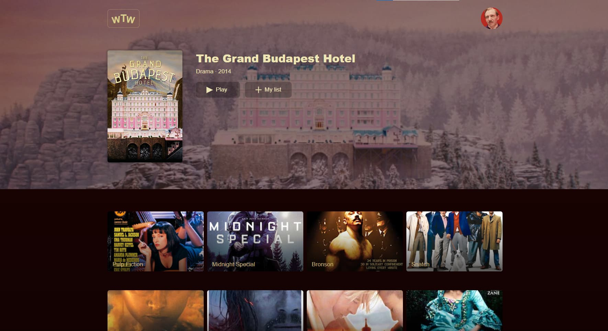

# What to watch
> Simple project to create a list of films for later viewing.



## [Live demo](https://github.com/devnikop/what-to-watch)(not available yet)

## Table of Contents

* [General info](#General-info)
* [Technologies](#Technologies)
* [Setup](#Setup)
* [Features](#Features)

## General info

This web application was created for mastering React.js.

## Technologies

* [React](https://reactjs.org/)
* [Redux](https://redux.js.org/)
* [Jest](https://jestjs.io/)

## Setup

To run this project, install it locally using npm:

### Prerequisites

- Node.js v.12.13.1
- Npm v.6.12.0

### Installing

```
npm run install
npm run start
```

## Features

* This app has no real use, it was created only to practice with some technologies.

### To do

* Add routing
* Rewrite on typescript

## Inspiration

This app is based on [Html Academy](https://htmlacademy.ru/)'s intensive [React. Разработка сложных клиентских приложений](https://htmlacademy.ru/intensive/react).

## License

[MIT License](LICENSE.md)
